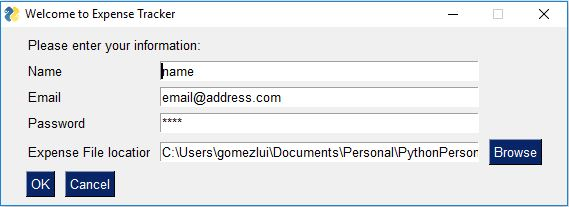
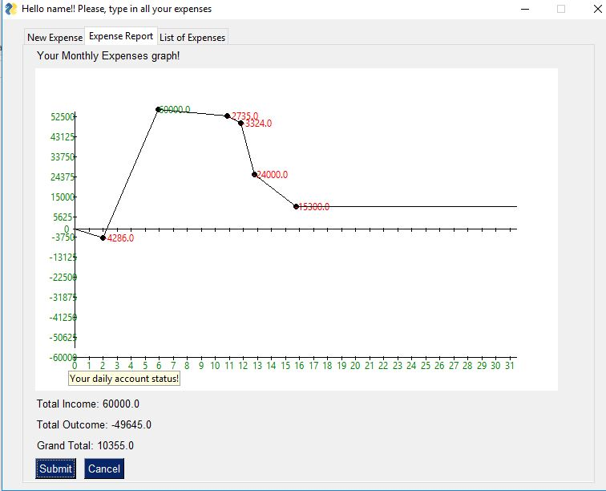
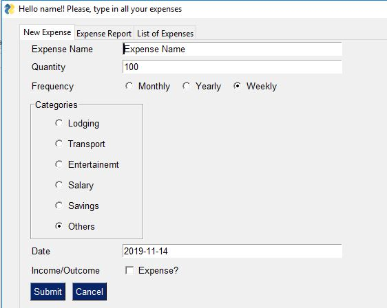

# Expense Tracker

Thanks to this application, you will be able to see and track your expenses. It will provide you of visual outputs, graphs, that will show your expenses.

## Installation
  - Microsoft Windows: Execute ExpenseTracker.exe for running.

## Motivation
Basically, learning about PySimpleGUI framework along with training my Python's skills with a small project like a Expense Tracker app.

## Build Status
It works!

## About my code

I have also used Python 3.7.4 and lib (pip freeze):
  - matplotlib==3.1.1
  - meross-iot==0.3.1.5
  - numpy==1.17.3
  - PyInstaller==3.5
  - PySimpleGUI==4.4.1
  - pysimplegui-exemaker==1.2.0

## Screenshots

## Usage

#### First Execution!
First window will ask for username/password and a file. If file exists and user and password are right, you will see a new window with your information; eoc. app will create a new file with this information and you will be redirect to a new window as well.

#### Tracking a new expense!
Simple complete all fields that are shown in tab1. Click confirm/submit and data will be stored in your file.

#### Show graph!
Just by clicking tab2 and/or by also clicking "Update Graph!" at the bottom, a graph with your expenses will be present.

#### Edit all your expenses!
Have you mistyped an expense? tab3 will list all your expenses and allow you to modify some fields.
Once is done, save it and new data will be stored in your file.

##### Notes:
- Expenses can be also directly edited in your file. Close app before editing it.

#### What have I learned?!

###### Links

###### Tools
  - [GitHub](http://github.com). http://github.com - automatic!
  - Wireframes
  - PySimpleGUI
  - Atom
  - numpy
